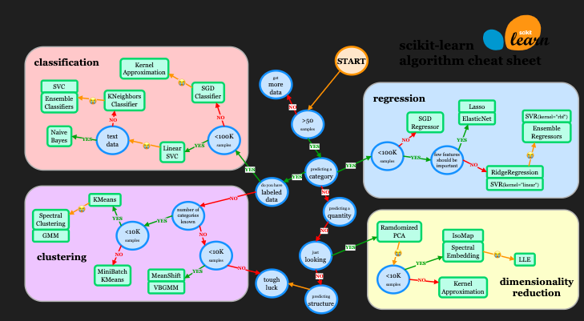

# Data Pre-Processing
- Import the data
- Clean the data
- Split into training & test sets
- Feature Scaling

# Modelling

- Build the model
- Train the model
- Make predictions

# Evaluation
- Calculate performance metrics
- Make a verdict
